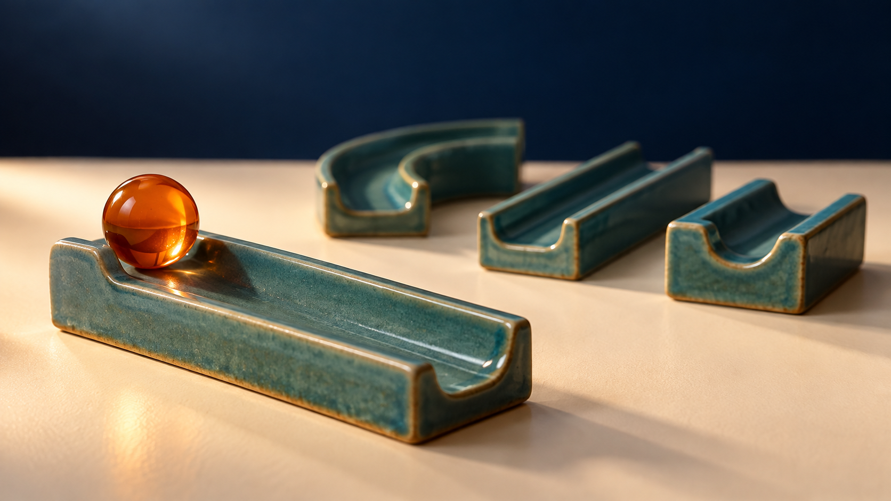

# Actual AI image trial

This is a newly generated raster image, not an SVG or a frame from the deterministic animation. It exercises the cloud/manual handoff route of `generate-image-and-video`: sanitized brief → provider generation → visual review → saved image with provenance. The built-in image tool supplied the generation capability; the portable Python client was not involved.

- Original image: 1672 × 941 pixels, PNG. No resizing or retouching applied.
- [Exact prompt](prompt.txt) and [asset provenance and checksum](manifest.json).
- Visually checked: subject, palette, no visible text/logos/people. Ceramic geometry is illustrative; it is not a physically verified track design.
- The provider did not expose a model identifier, seed, or cost. Repeating the prompt will not reproduce identical pixels.
- **A public local-video showcase is now available:** [presentation and three generated clips](../showcase/README.md). Existing source workflows also have generated video; see [workflow evidence](../../docs/WORKFLOW-EVIDENCE.md). This still is not evidence of image-to-video, motion consistency, a working ComfyUI server, or a particular hardware runtime.

## Try it with your provider

Ask your coding agent to read `generate-image-and-video`, use this prompt in a connected image-generation tool or your chosen cloud image service, save the returned image in your project, and inspect it before proceeding. If your harness has no generation tool, generate manually and supply the downloaded file. For local generation, select a configured ComfyUI profile and your own compatible API graph; a text-only endpoint cannot produce images simply because it supports Chat Completions.

## Next video trial

Use the reviewed still as the starting image. Request a four-second, locked-camera shot: the orange marble rolls slowly a short distance along the foreground track; spare modules and lighting remain unchanged; no text, cuts, camera travel, or extra objects. Run one job. Review opening, middle, ending and full playback for shape changes, penetration, flicker and motion direction. Record provider, model, graph/version if available, duration, dimensions, time and reported cost. Do not label a still pan/zoom as generative video.

This image is an AI-generated example supplied with the toolkit. Provider terms remain separate; no uniqueness or copyright eligibility is asserted. No customer input, source transcript, voice sample or personal setup was supplied to the generation tool.
