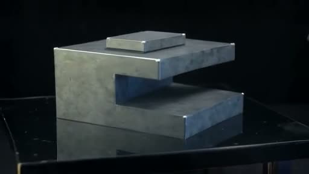

# From website to video-backed presentation

[**Open the live presentation →**](https://develotype-llc.github.io/media-presentation-skills/examples/showcase/presentation/)

[](https://develotype-llc.github.io/media-presentation-skills/examples/showcase/presentation/)

Ten editable sections, approximately six minutes of presenter notes, three original locally generated video clips, and a static leave-behind. Branding follows the public Develotype website. The story is a demonstration, not a customer case study.

## Run locally

From the repository root:

```sh
python3 -m http.server 8000 --bind 127.0.0.1
```

Open http://127.0.0.1:8000/examples/showcase/presentation/ . No inference server or API key is required to view the completed example.

## What was actually tested

- Three sequential text-to-video jobs with LTX 2.5; 345.91 seconds total submission/poll/download time.
- Each clip: 512 × 288, 97 frames, 24 fps, about four seconds, silent. These are preview-quality samples.
- Contact-sheet review and browser playback; presentation navigation, notes, direct links and mobile layout.
- All eight skills passed structural validation; 19 unit tests passed.

A runtime-specific driver submitted the jobs. The bundled generic client was checked in dry-run mode only. This does not establish image-to-video support, other hardware performance, or automatic discovery in every coding harness. Planning/coding used cloud assistants; video generation ran locally.

[Edit the presentation](presentation/README.md) · [Brand sources](presentation/BRAND-PROVENANCE.md) · [QA](presentation/QA.md) · [Media manifest](MEDIA-MANIFEST.json)
